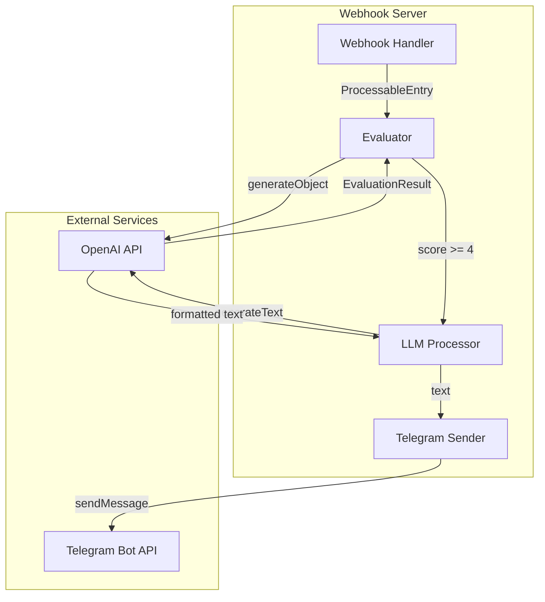
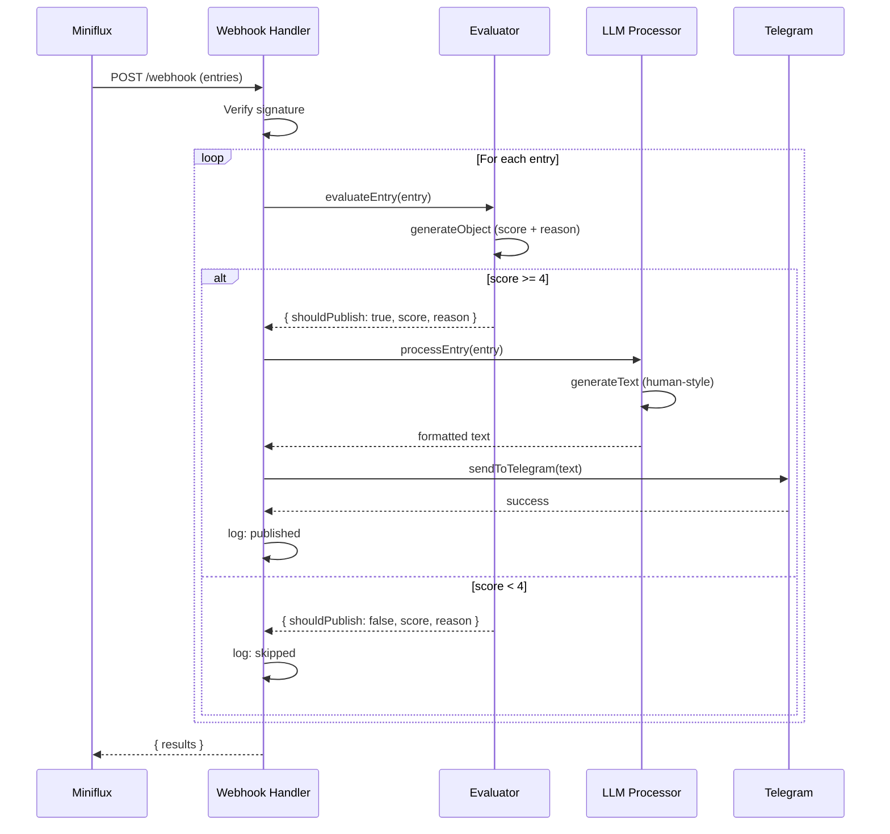

# Design Document: News Interest Filter

## Overview

Реализация двухэтапной обработки новостей с AI-оценкой интересности перед
публикацией. Новости с оценкой 4+ переписываются в человечном стиле и
публикуются в Telegram.

### Key Changes

1. Новый модуль `lib/evaluator.ts` — оценка интересности через `generateObject`
   с Zod-схемой
2. Обновление `lib/llm.ts` — новый промпт для человечного стиля и оформления
   ссылок
3. Расширение `lib/types.ts` — новые типы для результата оценки и обработки
4. Модификация `main.ts` — интеграция двухэтапной обработки с логированием

## Architecture

### Component Diagram



### Data Flow



## Components and Interfaces

### Evaluator Module

Новый модуль для оценки интересности новостей.

```typescript
// Path: apps/webhook/lib/evaluator.ts

import { generateObject } from 'ai';
import { z } from 'zod';
import type { EvaluationResult, ProcessableEntry } from './types.ts';

const EvaluationSchema = z.object({
  score: z.number().min(1).max(5).describe('Оценка интересности от 1 до 5'),
  reason: z.string().describe('Краткое обоснование оценки'),
});

export async function evaluateEntry(
  entry: ProcessableEntry,
): Promise<EvaluationResult> {
  const { object } = await generateObject({
    model: 'openai/gpt-5-mini',
    schema: EvaluationSchema,
    system: `Ты эксперт по оценке новостей для IT/tech Telegram-канала.

Оцени новость по шкале от 1 до 5:
- 5: Очень важная новость, затрагивает многих разработчиков
- 4: Интересная новость с практической ценностью
- 3: Средняя новость, может быть интересна части аудитории
- 2: Малоинтересная или узкоспециализированная новость
- 1: Неинтересно, спам или устаревшая информация

Критерии оценки:
- Актуальность и новизна
- Практическая ценность для разработчиков
- Уникальность контента
- Масштаб влияния`,
    prompt: `Оцени эту новость:

Заголовок: ${entry.title}
Источник: ${entry.feed.title}
Дата: ${entry.published_at}

Контент:
${entry.content}`,
  });

  return {
    score: object.score,
    reason: object.reason,
    shouldPublish: object.score >= 4,
  };
}
```

### Updated LLM Processor

Обновлённый промпт для человечного стиля написания.

```typescript
// Path: apps/webhook/lib/llm.ts

import { generateText } from 'ai';
import type { ProcessableEntry } from './types.ts';

export function processEntry(entry: ProcessableEntry) {
  return generateText({
    model: 'openai/gpt-5-mini',
    temperature: 0.7,
    system:
      `Ты автор популярного IT Telegram-канала. Пишешь интересно, живо и доступно.

СТИЛЬ:
- Пиши как живой человек, а не робот
- Используй разговорный тон, без канцеляризмов
- Добавляй эмодзи для акцентов, но не переборщи
- Только факты, без личного мнения и домыслов
- Переводи на русский, если контент на другом языке

ССЫЛКИ (ВАЖНО):
- ВСЕ ссылки оформляй как [осмысленный текст](url)
- Не используй "тут", "здесь", "ссылка" — пиши что по ссылке
- Ссылка на источник ОБЯЗАТЕЛЬНА в конце поста
- НЕ вставляй голые URL

ФОРМАТ:
- Markdown (жирный, курсив, ссылки)
- Хештеги на английском в конце
- БЕЗ таблиц

ОСОБЫЕ СЛУЧАИ:
- GitHub тренды: "В тренды GitHub ворвался [название](url) — ..."
- githubcontent ссылки — это картинки, на них ссылки не нужны`,
    prompt: `Перепиши эту новость в своём стиле:

Заголовок: ${entry.title}
Источник: ${entry.feed.title}
URL: ${entry.url}
Дата: ${entry.published_at}

${entry.content}`,
  });
}
```

### Updated Main Handler

Интеграция двухэтапной обработки.

```typescript
// Path: apps/webhook/main.ts (изменения)

import { evaluateEntry } from './lib/evaluator.ts';
import type { EntryProcessingResult } from './lib/types.ts';

// В handleWebhook:
const results: EntryProcessingResult[] = [];

for (const entry of payload.entries) {
  try {
    console.log(`Processing entry: ${entry.title} (ID: ${entry.id})`);

    const processable = mapToProcessableEntry(entry, payload.feed);

    // Step 1: Evaluate interest
    const evaluation = await evaluateEntry(processable);
    console.log(
      `Entry ${entry.id}: score=${evaluation.score}, reason="${evaluation.reason}"`,
    );

    if (!evaluation.shouldPublish) {
      console.log(`Skipping entry ${entry.id}: score below threshold`);
      results.push({
        id: entry.id,
        status: 'skipped',
        score: evaluation.score,
        reason: evaluation.reason,
      });
      continue;
    }

    // Step 2: Process and publish
    const aiResponse = await processEntry(processable);
    await sendToTelegram(aiResponse.text);
    console.log(`Published entry ${entry.id} to Telegram`);

    results.push({
      id: entry.id,
      status: 'published',
      score: evaluation.score,
      reason: evaluation.reason,
    });
  } catch (error) {
    const errorMessage = error instanceof Error ? error.message : String(error);
    console.error(`Failed to process entry ${entry.id}: ${errorMessage}`);
    results.push({
      id: entry.id,
      status: 'error',
      error: errorMessage,
    });
  }
}
```

## Data Models

### New Types

```typescript
// Path: apps/webhook/lib/types.ts (дополнения)

/** Результат оценки интересности новости */
export type EvaluationResult = {
  /** Оценка от 1 до 5 */
  score: number;
  /** Причина оценки */
  reason: string;
  /** Нужно ли публиковать (score >= 4) */
  shouldPublish: boolean;
};

/** Результат обработки одной новости */
export type EntryProcessingResult =
  | {
    id: number;
    status: 'published';
    score: number;
    reason: string;
  }
  | {
    id: number;
    status: 'skipped';
    score: number;
    reason: string;
  }
  | {
    id: number;
    status: 'error';
    error: string;
  };
```

## Error Handling

### Error Types and Handling

| Error                   | Handling             | Log Message                              |
| ----------------------- | -------------------- | ---------------------------------------- |
| Evaluation API error    | Skip entry, continue | `Failed to evaluate entry {id}: {error}` |
| Processing API error    | Skip entry, continue | `Failed to process entry {id}: {error}`  |
| Telegram send error     | Mark as error        | `Failed to send entry {id}: {error}`     |
| Invalid score (not 1-5) | Zod validation fails | Caught by generateObject                 |

### Fallback Strategy

```typescript
// При ошибке оценки — пропускаем новость (не публикуем)
try {
  const evaluation = await evaluateEntry(processable);
  // ...
} catch (error) {
  console.error(`Evaluation failed for ${entry.id}, skipping`);
  results.push({
    id: entry.id,
    status: 'error',
    error: `Evaluation failed: ${error.message}`,
  });
  continue;
}
```

## Testing Strategy

### Unit Tests

```typescript
// Path: apps/webhook/lib/evaluator.test.ts

import { assertEquals } from '@std/assert';
import { evaluateEntry } from './evaluator.ts';

Deno.test('evaluateEntry returns score between 1 and 5', async () => {
  const entry = {
    id: 1,
    title: 'Breaking: Major security vulnerability in npm',
    content: 'Critical vulnerability affects millions of packages...',
    url: 'https://example.com/news',
    published_at: '2024-01-01T00:00:00Z',
    feed: { title: 'Tech News' },
  };

  const result = await evaluateEntry(entry);

  assertEquals(result.score >= 1 && result.score <= 5, true);
  assertEquals(typeof result.reason, 'string');
  assertEquals(typeof result.shouldPublish, 'boolean');
});

Deno.test('shouldPublish is true when score >= 4', async () => {
  // Mock или интеграционный тест
});
```

### Integration Tests

```typescript
// Path: apps/webhook/main.test.ts

Deno.test('webhook skips low-score entries', async () => {
  // Отправить webhook с неинтересной новостью
  // Проверить что результат содержит status: 'skipped'
});

Deno.test('webhook publishes high-score entries', async () => {
  // Отправить webhook с интересной новостью
  // Проверить что результат содержит status: 'published'
});
```

### Edge Cases

1. **Пустой контент** — Оценка должна вернуть низкий балл (1-2)
2. **Очень длинный контент** — Truncate перед отправкой в LLM если нужно
3. **Контент на других языках** — LLM должен перевести и оценить
4. **Дубликаты** — Не обрабатываем на уровне evaluator (Miniflux отвечает за
   дедупликацию)

## File Changes Summary

| File               | Action | Description                                          |
| ------------------ | ------ | ---------------------------------------------------- |
| `lib/evaluator.ts` | Create | Новый модуль оценки интересности                     |
| `lib/types.ts`     | Modify | Добавить `EvaluationResult`, `EntryProcessingResult` |
| `lib/llm.ts`       | Modify | Обновить промпт для человечного стиля                |
| `main.ts`          | Modify | Интегрировать двухэтапную обработку                  |
| `deno.json`        | Modify | Добавить зависимость `zod`                           |

## Dependencies

Добавить в `deno.json`:

```json
{
  "imports": {
    "zod": "npm:zod@^3.23.0"
  }
}
```
